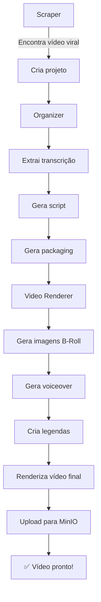

# 📹 Faceless Video Generator

Sistema automatizado para geração de vídeos faceless a partir de vídeos virais do YouTube.

## 🚀 Features

- **Scraping Automático**: Monitora canais do YouTube e identifica vídeos virais
- **Geração de Scripts**: Usa Gemini para adaptar histórias para múltiplos idiomas
- **Text-to-Speech**: Integração com Kokoro TTS para voiceover de alta qualidade
- **Geração de Imagens**: B-Roll gerado com IA usando Replicate
- **Legendas Automáticas**: Transcrição com AssemblyAI
- **Renderização de Vídeo**: FFmpeg para composição final
- **Interface Web**: Dashboard para gerenciamento completo

## 🏗️ Arquitetura

```
┌─────────────────────────────────────────────────────────────────┐
│                     Web Interface (FastAPI)                      │
│                    Gerenciamento de canais e projetos            │
└─────────────────────────────────────────────────────────────────┘
                                │
                                ▼
┌─────────────────────────────────────────────────────────────────┐
│                        Kestra Workflows                          │
│  ┌──────────────┐  ┌──────────────┐  ┌──────────────┐          │
│  │ Idea Scraper │  │  Organizer   │  │Video Renderer│          │
│  └──────────────┘  └──────────────┘  └──────────────┘          │
└─────────────────────────────────────────────────────────────────┘
                                │
                    ┌───────────┴───────────┐
                    ▼                       ▼
┌───────────────────────────┐  ┌───────────────────────────┐
│      Supabase             │  │        MinIO              │
│   (Database + Auth)       │  │    (Video Storage)        │
└───────────────────────────┘  └───────────────────────────┘
```

## 📁 Estrutura do Projeto

```
.
├── kestra/
│   └── flows/
│       ├── idea-scraper.yml       # Scraping de canais do YouTube
│       ├── video-organizer.yml    # Orquestrador principal
│       ├── transcript-fetcher.yml # Extração de transcrições
│       ├── script-generator.yml   # Geração de scripts com IA
│       ├── packaging-generator.yml # Títulos e thumbnails
│       ├── video-renderer.yml     # Renderização de vídeo
│       └── webhook-trigger.yml    # Endpoint webhook
│
├── web/
│   ├── app.py                     # FastAPI backend
│   ├── static/
│   │   ├── index.html            # Frontend HTML
│   │   ├── styles.css            # Estilos CSS
│   │   └── app.js                # JavaScript frontend
│   ├── Dockerfile                # Container Docker
│   ├── requirements.txt          # Dependências Python
│   └── DEPLOY.md                 # Guia de deployment
│
└── docs/
    └── kv-store-setup.md         # Configuração de credenciais
```

## 🔧 Requisitos

### APIs Necessárias

| Serviço | Uso | Como Obter |
|---------|-----|------------|
| **Google Gemini** | Geração de texto e vision | [ai.google.dev](https://ai.google.dev) |
| **Kokoro TTS** | Voiceover | Já instalado na sua VPS |
| **Replicate** | Geração de imagens | [replicate.com](https://replicate.com) |
| **AssemblyAI** | Transcrição/Legendas | [assemblyai.com](https://assemblyai.com) |

### Infraestrutura

- ✅ Kestra (já instalado)
- ✅ MinIO (já instalado)
- ✅ Supabase (projeto configurado)
- ✅ Kokoro TTS (já instalado)

## 📝 Setup Passo a Passo

### 1. Configurar KV Store no Kestra

Vá para [https://kestra.tribeai.com.br](https://kestra.tribeai.com.br) e adicione as seguintes chaves no namespace `company.team`:

```
SUPABASE_URL          = https://adkjkixcisfjogkrkupg.supabase.co
SUPABASE_ANON_KEY     = (seu anon key)
SUPABASE_SERVICE_KEY  = (seu service key - Dashboard > Settings > API)
MINIO_ENDPOINT        = https://console-projeto-1-minio.2eisou.easypanel.host
MINIO_ACCESS_KEY      = (sua access key do MinIO)
MINIO_SECRET_KEY      = (sua secret key do MinIO)
MINIO_BUCKET          = nca-toolkit
REPLICATE_API_TOKEN   = (seu token do Replicate)
ASSEMBLYAI_API_KEY    = (sua API key do AssemblyAI)
```

### 2. Deploy dos Workflows no Kestra

1. Acesse o Kestra UI
2. Vá para Flows > Import
3. Importe cada arquivo da pasta `kestra/flows/`

Ou use a API:
```bash
for file in kestra/flows/*.yml; do
  curl -X POST "https://kestra.tribeai.com.br/api/v1/flows" \
    -H "Content-Type: application/x-yaml" \
    --data-binary @"$file"
done
```

### 3. Deploy da Interface Web

#### No EasyPanel:

1. Crie um novo App
2. Conecte o repositório GitHub (ou faça upload do código)
3. Configure as variáveis de ambiente:
   - `SUPABASE_URL`
   - `SUPABASE_KEY`
   - `KESTRA_URL`
   - `KESTRA_NAMESPACE`
4. Deploy!

### 4. Adicionar Primeiro Canal

1. Acesse a interface web
2. Vá para "Channels"
3. Clique em "Add Channel"
4. Adicione o Channel ID do YouTube e configure o idioma

## 🌍 Idiomas Suportados

| Código | Idioma | Flag |
|--------|--------|------|
| pt-BR | Português (Brasil) | 🇧🇷 |
| en-US | English (US) | 🇺🇸 |
| es-ES | Español | 🇪🇸 |
| ja-JP | 日本語 | 🇯🇵 |
| it-IT | Italiano | 🇮🇹 |

## 💰 Custos Estimados por Vídeo

| Serviço | Custo |
|---------|-------|
| Gemini | ~$0.00 (free tier) |
| Replicate (6 imagens) | ~$0.06 |
| AssemblyAI | ~$0.01 |
| Kokoro TTS | Gratuito (self-hosted) |
| **Total** | **~$0.07 por vídeo** |

## 🔄 Fluxo de Funcionamento



## ❓ FAQ

### Como encontrar o Channel ID do YouTube?

1. Vá para a página do canal
2. Clique com botão direito > "Ver código fonte"
3. Procure por `channel_id` ou `externalId`
4. O ID começa com "UC" e tem 24 caracteres

### O vídeo ficou sem legendas, o que fazer?

Verifique se a API key do AssemblyAI está configurada corretamente no KV Store.

### O scraper não está encontrando vídeos virais?

- Verifique se os canais estão ativos
- Ajuste o threshold de views (padrão: 7000)
- Confirme que os canais têm vídeos recentes (< 48h)

## 📄 Licença

MIT License - use como quiser!
